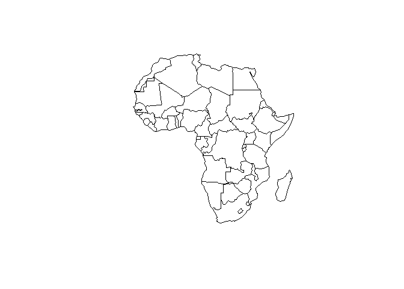
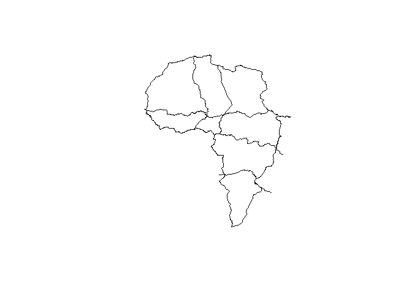
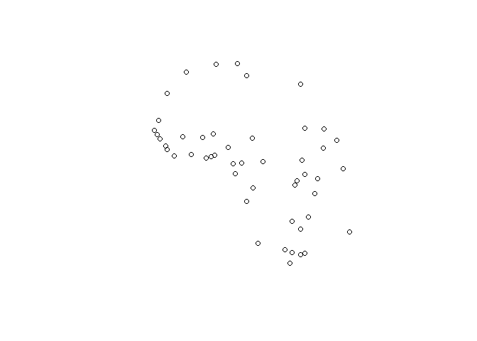
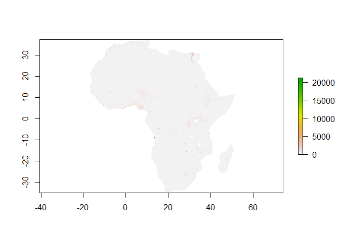
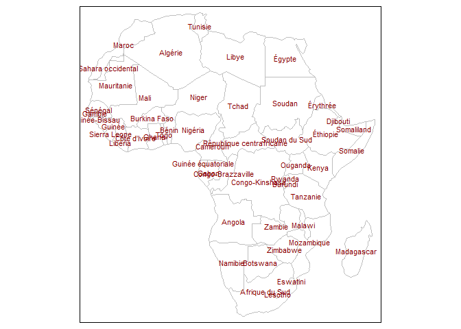
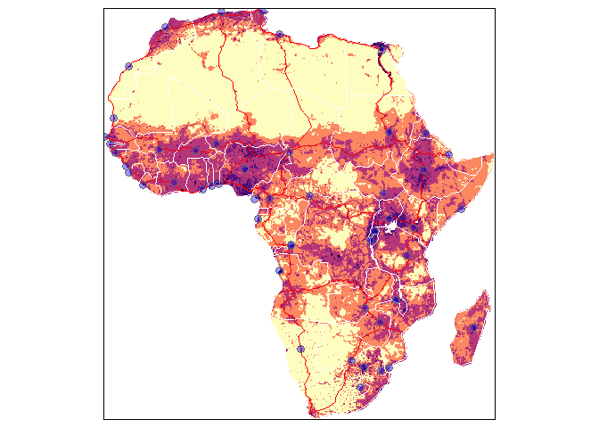

<!-- README.md is generated from README.Rmd. Please edit that file -->

<!-- used devtools::build_readme() to update the md -->

# afrilearndata <a href='https://github.com/afrimapr/afrilearndata'></a>

<!-- badges: start -->

<!-- badges: end -->

afrilearndata provides small African spatial datasets to help with
learning and teaching of spatial techniques and mapping.

The motivation is to provide analysts based in Africa with more easily
relateable example datasets. More generally we aim to support the growth
of R and mapping in the continent. Part of the
[afrimapr](https://afrimapr.github.io/afrimapr.website/) project
providing R building blocks, training and community.

## Installation

Install the development version of afrilearndata with:

``` r

    # install.packages("remotes") # if not already installed
    
    remotes::install_github("afrimapr/afrilearndata")
    
    library(afrilearndata)
```

## Datasets

The package contains the following objects

1.  `africontinent` polygons, continent outline including madagascar
2.  `africountries` polygons, 51 country boundaries
3.  `afrihighway` lines, trans African highway network (100 lines)
4.  `africapitals` points, 51 capital cities
5.  `afriairports` points, \>3000 African airports
6.  `afripop2020` raster grid, population density 2020 from
    [WorldPop](https://www.worldpop.org/) aggregated to 20km squares
7.  `afripop2000` raster grid, population density 2000 from
    [WorldPop](https://www.worldpop.org/) aggregated to 20km squares
8.  `afrilandcover` raster grid, landcover in 2019, categorical, 20km
    from [MODIS](https://lpdaac.usgs.gov/products/mcd12c1v006/)

Lazy loading means that the objects should be accessible once
`library(afrilearndata)` is used.

If they are not recognised you can use e.g. `data(africountries)` to
make sure the objects are loaded.

As well as providing the data as R objects the package provides them as
files that can be used to demonstrate the process of reading spatial
data into R and the read code is provided in the documentation of each
dataset. The different datasets cover the following formats commonly
used to store sptial data : geopackage, shapefile, kml, tiff, csv and
grd.

Firstly, here are most of the data shown together. The `tmap` code to
create this plot is shown later in the readme.


Now looking at the data layers individually plotted with packages `sf`
or `raster`

``` r

library(afrilearndata)
library(sf)

# polygons
plot(sf::st_geometry(africountries))
```



``` r

# lines
plot(sf::st_geometry(afrihighway))
```



``` r

# points
plot(sf::st_geometry(africapitals))
```



Population density data are from WorldPop clipped to Africa and
aggregated to 20km resolution to make them more manageable.
[WorldPop](https://www.worldpop.org/) datasets are licensed under
[Creative Commons Attribution 4.0
International](https://creativecommons.org/licenses/by/4.0/).

``` r

# raster grid
# install.packages("raster") # if not already installed
library(raster)
plot(afripop2020)
```



The `africountries` data has country names in French, Portuguese,
Swahili, Afrikaans and English, that can be used to label maps as
follows.

``` r

library(afrilearndata)

# install.packages("tmap") # if not already installed
library(tmap)

tm_shape(africountries) +
     tm_borders("grey", lwd = .5) +
     tm_text("name_fr", auto.placement=FALSE, remove.overlap=FALSE, just='centre', col='red4', size=0.7 )
```



Interactive maps can be created using the `mapview` package.

``` r

# install.packages("mapview") # if not already installed

library(mapview)
mapview::mapview(africountries, zcol="name")
#here to show all airports on the continent
mapview(afriairports, zcol='type', label='name', cex=2)
  
```

Landcover data for the continent is provided as the majority landcover
in 2019 at 20km resolution obtained from
[MODIS](https://lpdaac.usgs.gov/products/mcd12c1v006/). An interactive
landcover map can be displayed with `mapview`.

``` r

# install.packages("mapview") # if not already installed

library(mapview)

mapview(afrilandcover,
       att="landcover",
       col.regions=levels(afrilandcover)[[1]]$colour)
  
```

Here is a repeat of the map shown at the start of the readme, together
with the code used to create it.

``` r

library(afrilearndata)

# install.packages("tmap") # if not already installed
library(tmap)

# tmap_mode("view") to set to tmap interactive viewing mode

tm_shape(afripop2020) +
    tm_raster(palette = rev(viridisLite::magma(5)), breaks=c(0,2,20,200,2000,25000)) +
tm_shape(africountries) +
    tm_borders("white", lwd = .5) +
tm_shape(afrihighway) +
    tm_lines(col = "red") + 
tm_shape(africapitals) +
    tm_symbols(col = "blue", alpha=0.4, scale = .6 )+
tm_legend(show = FALSE)
```



## Learning Resources

For learning resources using these data see our [afrilearnr interactive
tutorials](https://github.com/afrimapr/afrilearnr), resources in English
& French for a [4 hour entry level
tutorial](https://github.com/afrimapr/r-maps-tutorial-fr-eng) and the
in-progress [afrimapr book](https://github.com/afrimapr/afrimapr-book).

## Related

For other and larger spatial datasets see the [spData
package](https://github.com/Nowosad/spData) which was part of the
inspiration for afrilearndata.

## Contributions

afrilearndata is part of
[afrimapr](https://afrimapr.github.io/afrimapr.website/) we welcome
[issues and enhancement
requests](https://github.com/afrimapr/afrilearndata/issues).
